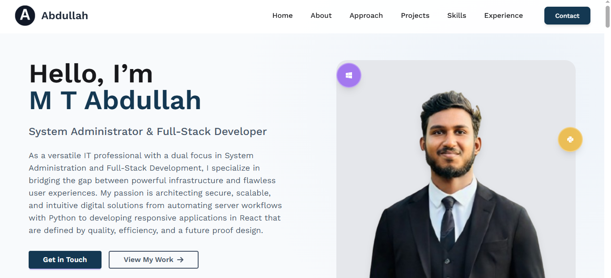

# Abdullah's Professional Portfolio

[](https://react.dev/)
[](https://vitejs.dev/)
[](https://tailwindcss.com/)

This is the official repository for my personal portfolio website, built from the ground up to showcase my skills in System Administration, Full-Stack Development, and modern web technologies.

### [➡️ View Live Demo](https:/mt-abdulla/.github.io/abdullah-dev/)


---




## 📋 About This Project

This portfolio is a fully responsive, single-page application designed to provide a comprehensive overview of my professional journey, technical skills, and key projects. It was built using a modern, performance-oriented tech stack to ensure a fast and seamless user experience.

### ✨ Key Features

*   **Professional Hero Graphic:** A dynamic introduction with animated, floating icons representing key skills.
*   **Career Trajectory Timeline:** A custom-built, two-column timeline detailing my professional experience and accomplishments.
*   **6-Category Skills Grid:** A detailed and organized showcase of my technical competencies across different domains.
*   **Featured Projects Showcase:** A grid of my most impactful projects with links to live demos and source code.
*   **Professional Contact Hub:** A unified section with multiple ways to connect and a fully functional contact form.
*   **Fully Responsive:** The entire layout is mobile-first and adapts beautifully to all screen sizes.

## 🛠️ Technologies Used

*   **Frontend:** React 19, Vite, Tailwind CSS, DaisyUI
*   **Libraries:** React Router, React Scroll, Swiper.js, Font Awesome
*   **Deployment:** GitHub Pages

## 🚀 Getting Started (Local Setup)

To run this project on your local machine, follow these steps:

1.  **Clone the repository:**
    ```bash
    git clone https://github.com/mt-abdullah/abdullah-dev.git
    ```

2.  **Navigate to the project directory:**
    ```bash
    cd abdullah-dev
    ```

3.  **Install dependencies:**
    ```bash
    npm install
    ```

4.  **Run the development server:**
    ```bash
    npm run dev
    ```
    The application will be available at `http://localhost:5173`.

## 👨‍💻 Author

**M T Abdullah**

-   **GitHub:** [@mt-abdullah](https://github.com/mt-abdullah)
-   **LinkedIn:** [in/mt-abdullah](https://linkedin.com/in/mt-abdullah)

## 📄 License

This project is licensed under the MIT License. Copyright &copy; 2025 M T Abdullah.
